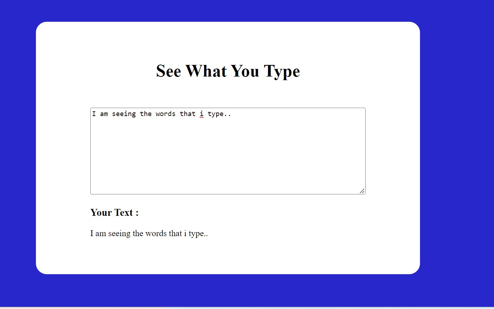

# SeeWhat you Type

This is a simple  website containing input and output text box. When the user types anything in input box, it is displayed in output box.

**Live link**

[See what you type](https://js-project-see-what-you-type.netlify.app/)

**Technology  Used**

1.HTML

2.CSS

3.Javascript

**Previews**

